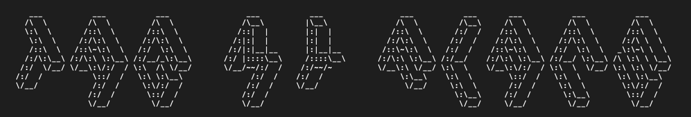

# TagMyFlac
ID3 tagger for music files



## Table of Contents

1. [Installation](https://github.com/koeves/TagMyFlac#installation)
2. [Basic use-case scenarios](https://github.com/koeves/TagMyFlac#basic-use-case-scenarios)  
  2.1 [Basic metadata from filename](https://github.com/koeves/TagMyFlac#i-basic-metadata-from-filename)  
  2.2 [Scraping tags from files](https://github.com/koeves/TagMyFlac#ii-scraping-tags-from-files)  
  2.3 [Printing all tags of a file](https://github.com/koeves/TagMyFlac#iii-printing-all-tags-of-a-file)  
  2.4 [Adding custom tags from JSON](https://github.com/koeves/TagMyFlac#iv-adding-custom-tags-from-json)  
  2.5 [Exporting metadata in JSON](https://github.com/koeves/TagMyFlac#v-exporting-metadata-in-json)

## Installation

Clone or download the repo and `cd` into the directory.

Use `pip3` to install requirements:

```bash
$ sudo -H pip3 install -r requirements.txt
```

Run `tagmyflac.py`:

```bash
$ python3 tagmyflac.py --help
```

The output should now be the following:

```bash

          ______                  __   
_________/     \\     _____      / /   _______    ____    ___
|__   __|  ____  |   //  \_\     /_/   |  ___|  //   \\_//  \\
   | |  |  |__|  |  ||  _____          |  |_   | |     V    | |
   | |  |        |  ||     ||          |   _|  | |     |    | |
   | |  |   __   |   \\___//           |  |____| |          | |
   |_|  |__|  |__|                     |_______|_|          |_|


usage: tagmyflac.py [-h] [-s SOURCE] [-v] [-r] [-p] [--scrape]
                    [--print_valid_keys] [-t TAGS]

Tag My FLAC

optional arguments:
  -h, --help            show this help message and exit
  -s SOURCE, --source SOURCE
                        source path of directory of your files
  -v, --verbose         increase output verbosity
  -r, --retag           tags title and artist
  -p, --print           print metadata tags
  --scrape              scrape ID3 tags from files
  --print_valid_keys    print taggable keys list
  -t TAGS, --tags TAGS  write the provided key-value pairs as tags
```

You can always access this help page via the `-h` or `--help` flags.

## Basic use-case scenarios

### I. Basic metadata from filename
Supppose you have some online rips of songs.
Name them the following way: 
`ARTIST NAME - SONG TITLE [CAT_ID/ALBUM NAME -- optional].mp3`

You can then use TagMyFlac to automatically add the given ID3 metadata for the files in the source directory *recursively*:

```bash
$ python3 tagmyflac.py -vrs <source directory>
```
 
#### A note on source directory paths
By default, when you provide a directory's path you would exclude the trailing slash `/`. This however will result in file changes only *one level* down the tree. Would you prefer to walk all subdirectories, put an ending slash `/` after the source directory path.

### II. Scraping tags from files

You can reset the tags from your files by running

```bash
$ python3 tagmyflac.py --scrape -vs <source directory>
```

The `--scrape` flag reinitialises the files again, so you can run the `--retag` option easily.  
  
Scenarios I. and II. can also be combined naturally:
```bash
$ python3 tagmyflac.py --scrape -vrs <source directory>
```

### III. Printing all tags of a file

Just use the `-p` or `--print` flags:

```bash
$ python3 tagmyflac.py --print -s <source directory>
```

Consider, that the printing evaluation is the last element in the chain, therefore, when combining the `--print` flag with other potentially tag-modifying flags, printing will show the end result.

### IV. Adding custom tags from JSON

You can use the `-t` or `--tags` flag and provide a *preformatted* JSON with the following format to write them onto your files:
```javascript
'{"key": "value", "key": "value"}'
```

Example: 
```bash
$ python3 tagmyflac.py -vps <source directory> --tags '{"genre": "minimal"}'
```

### V. Exporting metadata in JSON

You can use the `-e` or `--export` flags to produce a JSON file with all your songs metadata (to be used for restores etc.)

```bash
python3 tagmyflac.py --export -s <source directory>
``` 